# Blender & Roblox Portfolio — Alex Smith

Low-poly characters, environments, and Roblox game systems.  
Contact: grandmasta1024@gmail.com · Roblox: GrandMastaShake

---

## Adopt Me-Style Creatures — `creatures.blend`

Eight chibi characters built to Adopt Me proportions: HEAD > BODY ratio, no neck, big expressive eyes, tiny feet. Dragon, cat, fox, raccoon, deer, and friends.

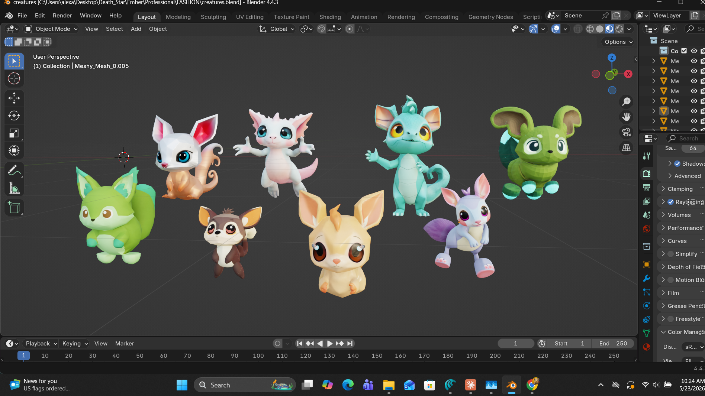

---

## Chibi Cat Build — `petproto.blend`

Orange tabby modeled to spec: head r=1.0 / body r=0.62, pointy ears with pink inners, large sclera eyes with shine dot, cheek puffs, shade smooth throughout. Built in Blender 4.4.

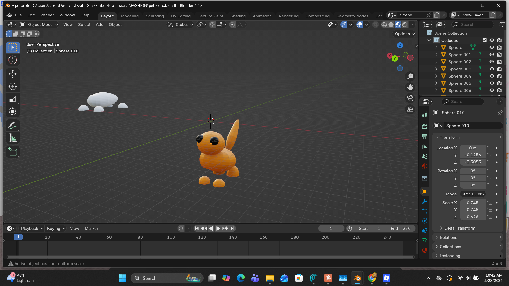

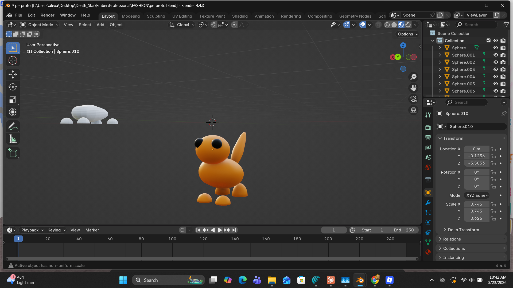

---

## Low-Poly Environment

Trees, shrubs, and rocks. 55 objects, 1,389 vertices, 2,592 faces — kept light for real-time use.

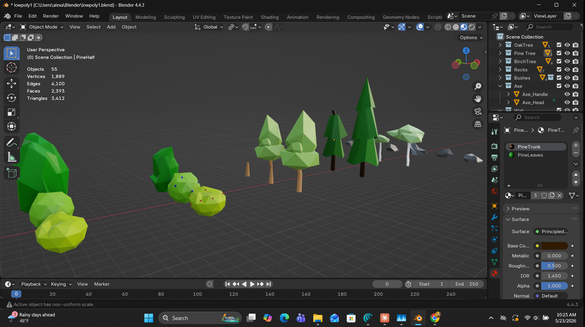

---

## The Donut

Blender fundamentals: subdivision surface, procedural materials, Cycles lighting. The rite of passage.

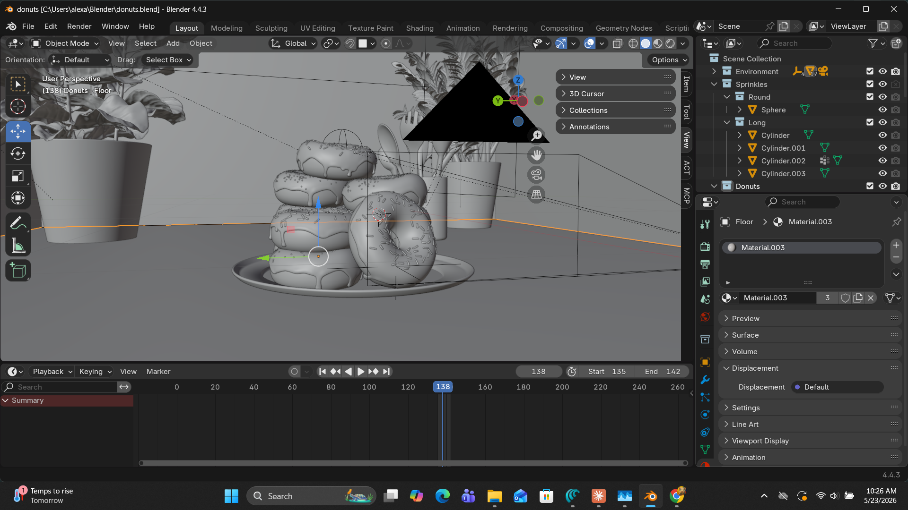

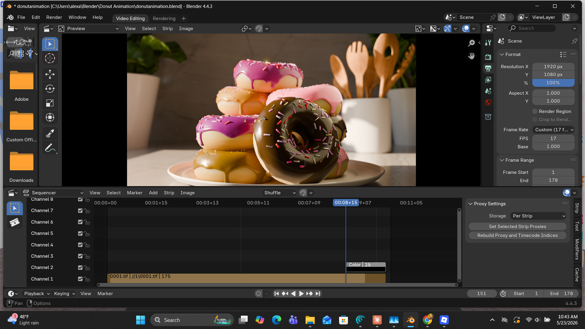

---

## Roblox Studio — Game Systems

49-module strict Luau library synced live via Rojo. DI + EventBus architecture. Scenes below show the map builder plugin output and the AnalyticsManager wired up in the editor.

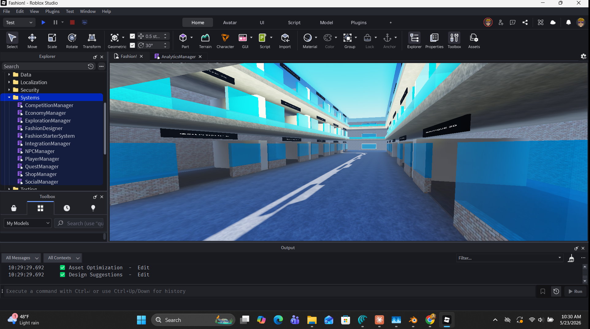

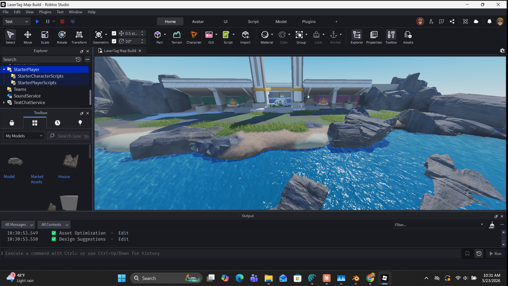

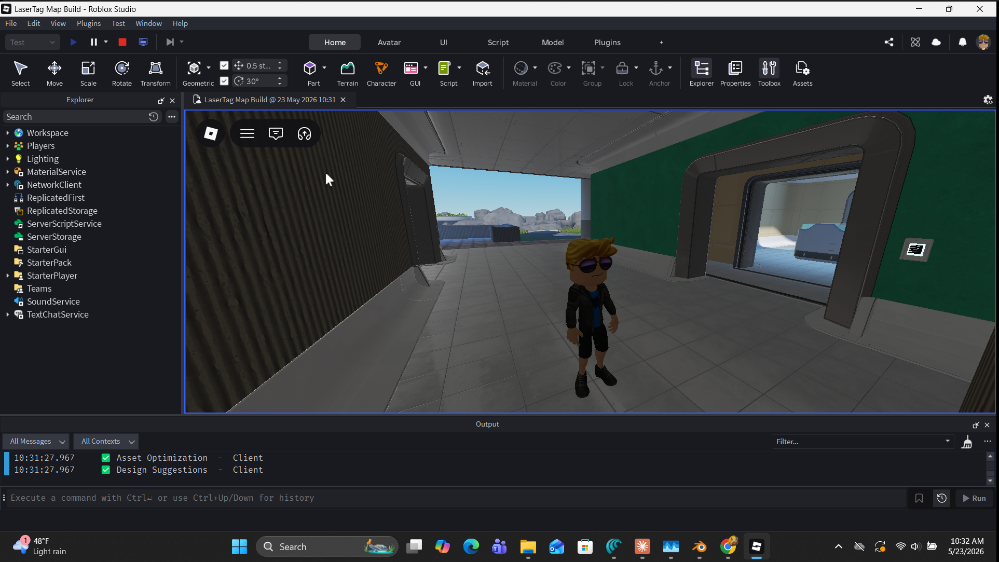

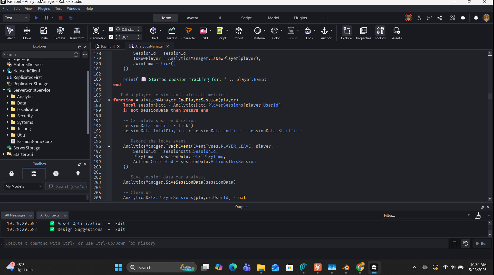

---

## Adopt Me — In Game

Actual gameplay. The sushi penguin hatch is what started all of this.

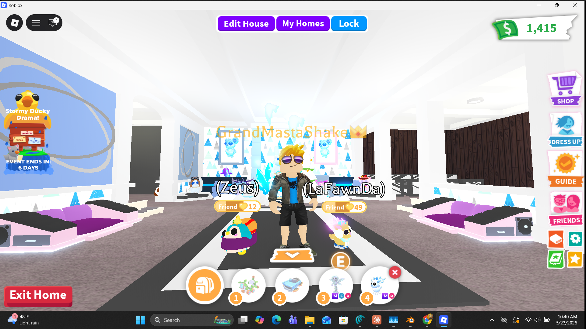

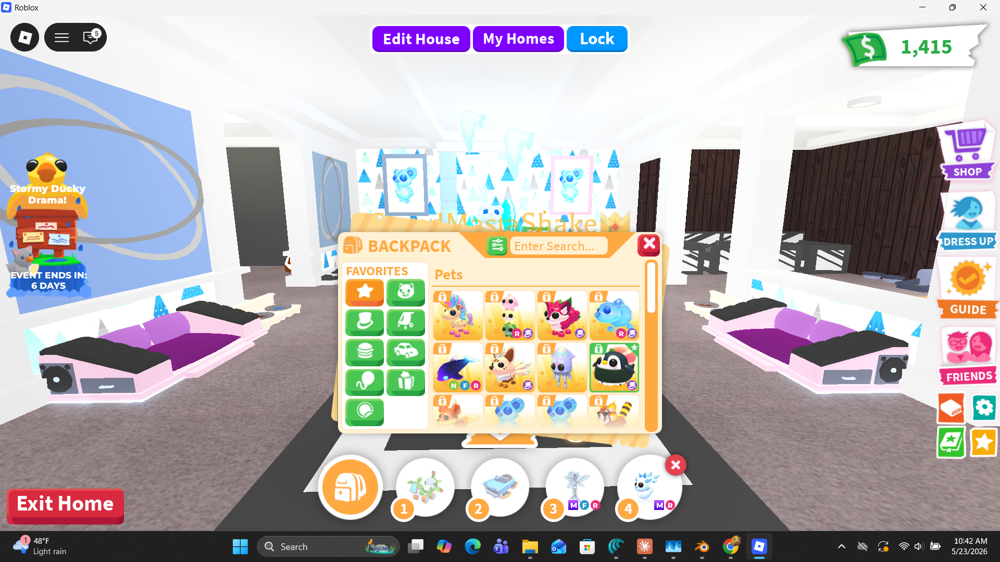

---

*Tools: Blender 4.4 · Roblox Studio · Rojo · Luau `--!strict`*  
*Game systems: [roblox-modular-lib](https://github.com/GrandMastaShake/roblox-modular-lib)*  
*Asset pipeline: [bits-and-baubles-blender-kit](https://github.com/GrandMastaShake/bits-and-baubles-blender-kit)*
